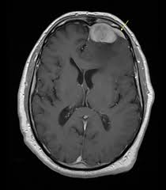

# 🧠 Brain Tumour Detection – URSS Research Project 2025

This repository contains my work from a summer research project at the University of Warwick, as part of the Undergraduate Research Support Scheme (URSS). The goal of the project was to explore machine learning models for detecting brain tumours in medical images (MRI scans).

You can try my final BCNN model with this link:

https://huggingface.co/spaces/ignaciovgl/Brain_Tumor_Classification_Using_BCNN 

---

## 🎯 Project Goals

- Investigate ML techniques for brain tumor classification, using a Support Vector Machine (SVM) as a baseline, and comparing it to advanced Convolutional Neural Networks (CNNs) and a Bayesian Convolutional Neural Network (BCNN).
- Understand preprocessing challenges with medical imaging data, including resizing and feature extraction techniques like Histogram of Oriented Gradients (HOG)
- Evaluate trade-offs between accuracy, computational efficiency, and, most importantly for a medical application, uncertainty quantification.

---

## 🔍 Overview

The project involves:

- Loading and preprocessing over 7,000 grayscale MRI scans from a public Kaggle dataset.
- Applying a conventional ML model, an SVM, using both Linear and Radial Basis Function (RBF) kernels and One-vs-One (OvO) and One-vs-All (OvA) multi-class strategies
- Exploring a state-of-the-art deep learning model, a CNN based on the ResNet-18 architecture, and training it using a two-phase transfer learning approach
- Implementing a probabilistic model, a Bayesian CNN, to explicitly quantify prediction uncertainty.
- Evaluating models using key performance metrics such as accuracy, and visualizing results with confusion matrices

---

## 🛠️ Tech Stack

- **Python** (NumPy, Matplotlib, scikit-learn)
- **PyTorch** and **Pyro** for building and training deep learning and Bayesian models on GPU 
- **Google Colab** and **Jupyter Notebooks** for analysis and experimentation 

---

## 📊 Model Performance

**Support Vector Machine (SVM)**
The best-performing SVM model utilised the RBF kernel and the One-vs-One (OvO) multi-class strategy. It achieved a test accuracy of 96.8%. The use of HOG feature extraction was crucial for this strong performance, as it provided a robust representation of image shapes and gradients to the classifier. The results are summarised in the table below:

| Metric         | Value   |
|----------------|---------|
| Accuracy       | 96.8%   |
| Precision      | 97%   |
| Recall         | 97%   |
| F1 Score       | 97%   |

**Convolutional Neural Network (CNN)**
The CNN, based on the ResNet-18 architecture, achieved a remarkable final test accuracy of **99.22%**. This superior performance demonstrates the power of deep learning to automatically learn complex features directly from raw image data, unlike the **SVM** which requires hand-crafted features. The CNN's high accuracy was largely due to a robust two-phase training strategy that involved transfer learning from the ImageNet dataset.

**Bayesian Convolutional Neural Network (BCNN)**
The BCNN model, also based on ResNet-18, matched the standard CNN's accuracy with a final test accuracy of **99.22%**. Its primary advantage is its ability to quantify the uncertainty of its predictions, a critical feature for high-stakes medical diagnosis. For example, when the model makes a misclassification, it often provides a less confident prediction with a more diffuse probability distribution across multiple classes, alerting a clinician to the potential for error.

---

## 📁 Project Structure
- **Introduction** 
- **Introduction to Computer Vision** 
- **SVM** (Looking at the mathematics behind the model, implementing and evaluating it)
- **CNN** (Same as SVM)
- **BCNN** (Same os other models)
- **Comparison** (Compare models' performance and computational efficiency)
- **Conclusion**

- 
---

## Example Image of Dataset

